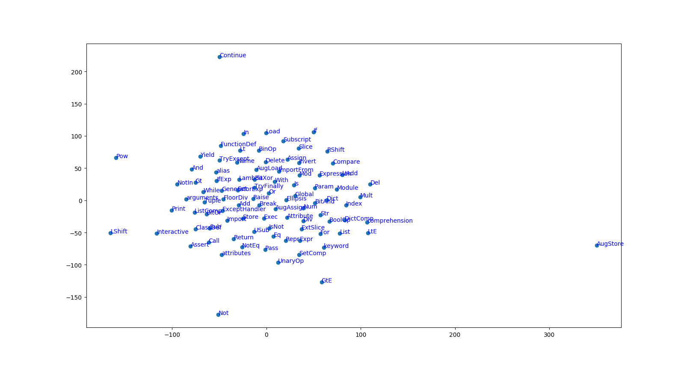

# Encoding the AST Tree using a strategy similar to word2vec, but applied to the context of AST's

This work is an attempt to learn vector representation for AST nodes. The original paper is: [Building Program Vector Representations for Deep Learning](https://arxiv.org/abs/1409.3358) at AAAI 2015. Instead of using the method proposed in this paper, I use the strategy similar to word2vec to learned embeddings of AST nodes. 

* Vectors are learned by a variation of word2vec instead of the proposed method. The intuition is similar to the original paper, by capture the context of a parent node by learning the vectors of its children. The difference is that in the original paper, they tried to minimize the distance between the parent node and the sum vectors of its children. In this work, given a specific token type as the input, look at its children and pick one at random. The network is going to tell us the probability for every token in our vocabulary of being its child that we chose. The vocabulary is relatively small since the number of token types of AST is small (around 92 token types).

* Adam Optimizer is used instead of Stochastic Gradient Descent.

* The dataset used in this implementation is smaller than in the original paper. I crawled Python algorithms from Github by myself since using the built-in Python AST parser for Python code is more convenient and less time-consuming than writing the AST Parser for the C++ code in the original dataset, thus the node type is a little bit different.

### How to run
```python
python2 train.py
```

The list of learned token vectors can be found here:
https://github.com/bdqnghi/ast-node-encoding/blob/master/data/vectors.txt

A visualization of learned token
--------------------------

